The latest updated code has been pushed to the main branch.

<!-- Tech Stack Used -->

Next.js – React framework for building a fast, scalable, and SEO-friendly application.
Tailwind CSS – Utility-first CSS framework used for responsive and maintainable styling.
Framer Motion – Used to implement smooth animations and interactive UI transitions.

<!-- GitHub Repository -->

https://github.com/sunilpixel/engineered-for-passion.git

<!-- Project Overview -->

This project is built using Next.js to provide a fast, scalable, and SEO-friendly web experience. Next.js supports Server-Side Rendering (SSR), which helps improve initial page load performance and search engine optimization.

I also used Next.js's built-in Image component for image optimization, making it easier to handle responsive images, optimize image loading, and improve overall website performance.

The project also benefits from code splitting, which helps load only the JavaScript required for specific pages or components. Next.js provides automatic file-based routing, making route management simple and easy to maintain.

The application is built with a scalable component-based structure, allowing new features and sections to be added easily. Tailwind CSS is used to create a responsive UI that works smoothly across desktop, tablet, and mobile screen sizes.

Overall, the combination of Next.js, Tailwind CSS, image optimization, code splitting, SSR, and responsive components helps provide a performant and maintainable frontend.

<!-- How to run your project. -->

1. Clone the Repository
   git clone <your-github-repository-url>
   cd <project-folder>

2. Install Dependencies
   npm install/npm i

3. Start the Development Server
   npm run dev

4. Open the Project
   Open the following URL in your browser => http://localhost:3000

<!-- Live Link -->

https://engineered-for-passion-neon.vercel.app/

<!-- Assumptions / Decisions Made -->

1. Used the provided Figma design as the primary reference for the UI implementation.
2. Implemented responsive behavior for desktop, tablet, and mobile screen sizes.
3. Implemented a light/dark theme toggle and persisted the selected theme using localStorage.
4. Used Framer Motion for smooth animations and UI transitions.
5. Structured the UI into reusable and maintainable components for easier future development.
6. Where the Figma design did not specify certain interactions, simple and user-friendly behavior was implemented.

<!-- Work Demonstration -->

Theme Toggle

Implemented a theme toggle button that allows users to switch between light and dark modes.

The selected theme is saved in localStorage, so when the user visits the website again, their previously selected theme is automatically restored instead of resetting to the default theme.
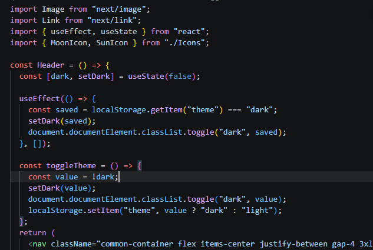

<!-- Timeline Animation -->

Implemented the timeline as a client-side interactive component using React state and effects.

Used Framer Motion for smooth animations and transitions.
Created multiple reusable timeline components such as Hero, Track, Delivery, and Thanks.
Used a cue-based timeline system to control different animation phases and steps.
Used useEffect and setTimeout to automatically progress through the timeline sequence.
Added AnimatePresence to smoothly enter and exit timeline sections.
Added reduced-motion support using MotionConfig for users who prefer reduced animations.

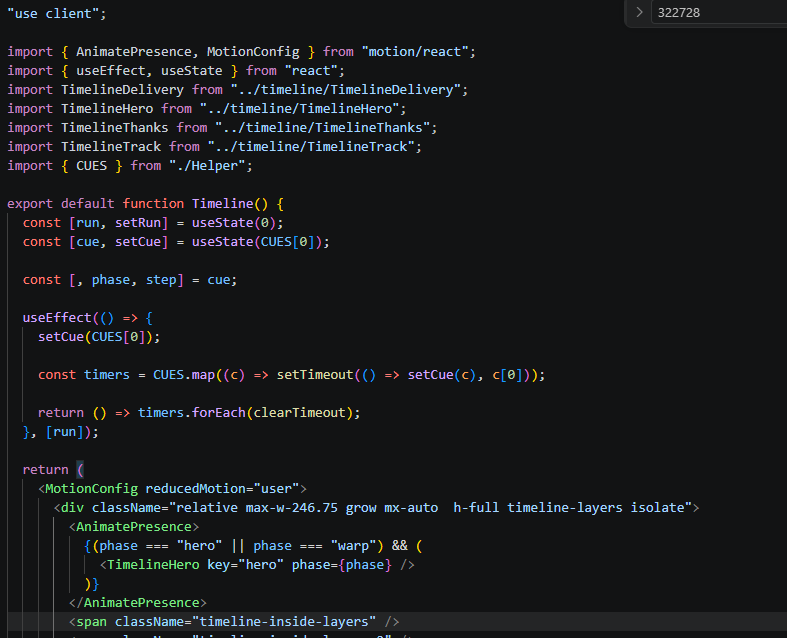

<!-- Dynamic Content Rendering -->

Created different cases based on activeId to render the corresponding content for each section. Each case displays the required component or content dynamically.
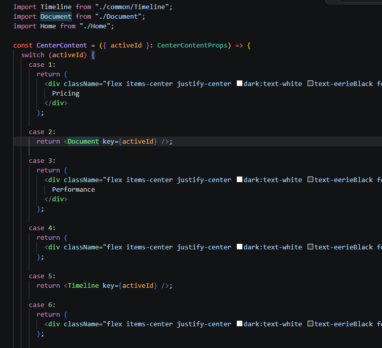

<!-- Helper -->

Used a helper function/component to keep the logic clean, reusable, and easy to maintain.

<!-- Common Layout -->

Created a common layout component to keep shared elements such as the Header, Hero, Content, Footer, and Drawer consistent across the application.

Used React state to manage the active section and drawer open/close state.
Used activeId to dynamically update the content and selected section.
Used useEffect to control the document body overflow when the drawer is opened, preventing background scrolling.
Passed state and event handlers to child components through props for communication between components.
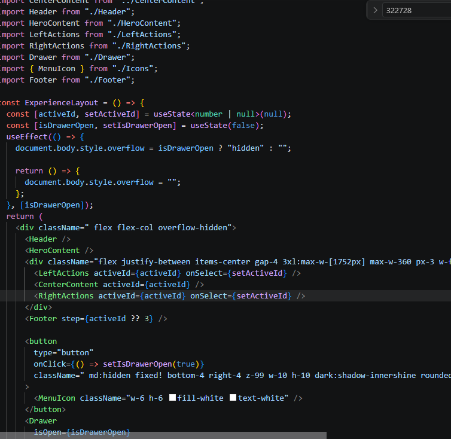

<!-- Global Type Definitions -->

Created a global types/index.d.ts file and included it in tsconfig.json so that shared TypeScript types, such as props types, can be used throughout the project without importing them into every component. This keeps the code cleaner and avoids repetitive type imports.
tsconfig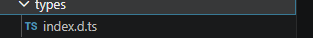
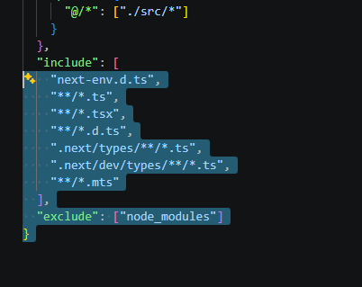

<!-- Image Assets -->

Organized the project images into separate folders based on image format and usage, keeping the assets structured and easy to manage.
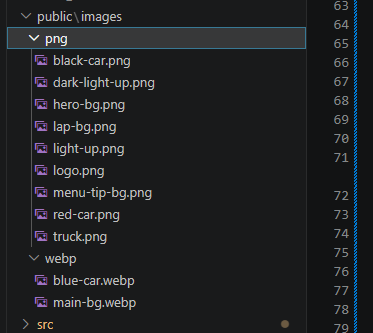

<!-- Fonts & Tailwind CSS -->

Added the required custom fonts using @font-face and configured different font weights for SF Pro Display. Also imported Shrikhand from Google Fonts.

Imported Tailwind CSS in the global stylesheet to use utility classes throughout the project.
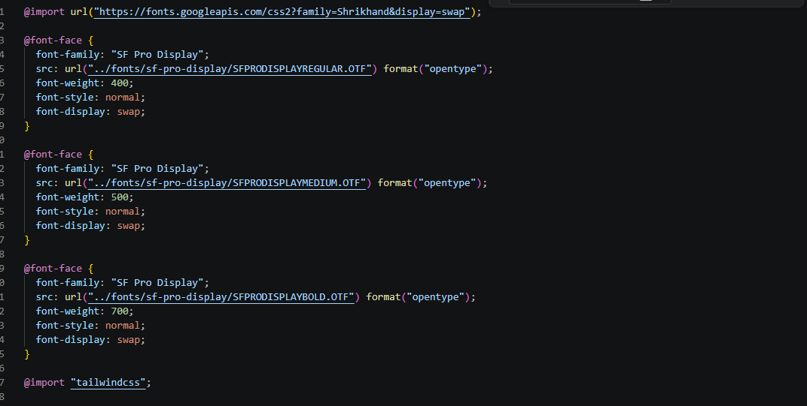

<!-- Custom Theme Configuration -->

Created a custom Tailwind theme configuration with reusable:

Custom colors
Custom fonts
Responsive breakpoints
Text shadows
Custom shadows
Dark theme support
Reusable design tokens

This helps maintain consistent styling across the project and makes responsive design and theme customization easier.
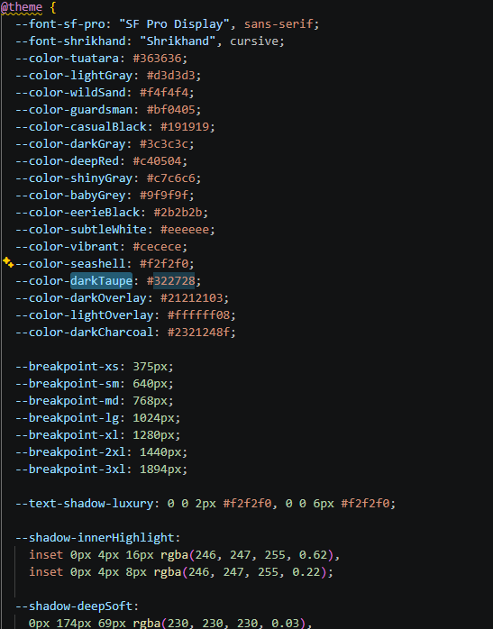
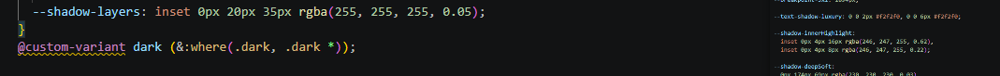

<!-- Custom Gradient Border -->

Created a reusable .gradient-border utility using a pseudo-element and CSS gradient to achieve a custom gradient border effect with rounded corners while keeping the border styling flexible and reusable.
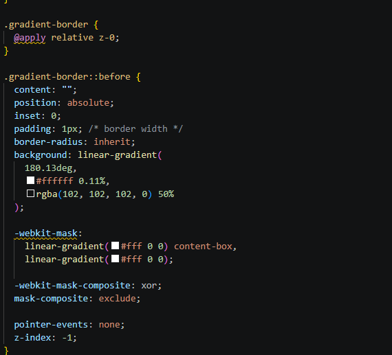

<!-- Document Background Reveal Animation -->

Created a custom CSS keyframe animation for the document background reveal effect. The animation smoothly changes the element’s opacity and scale during the reveal, creating a polished entrance animation.
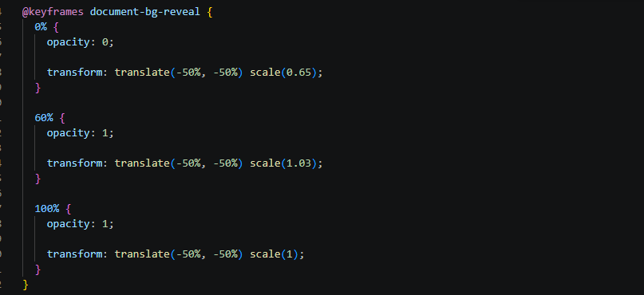
